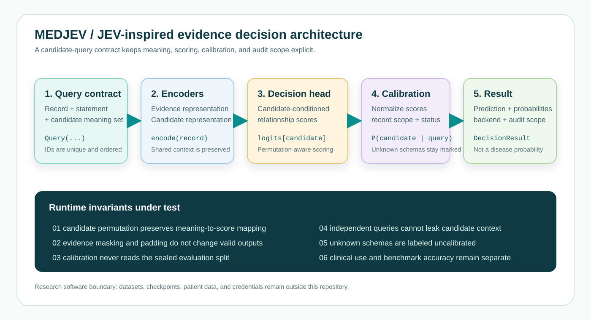
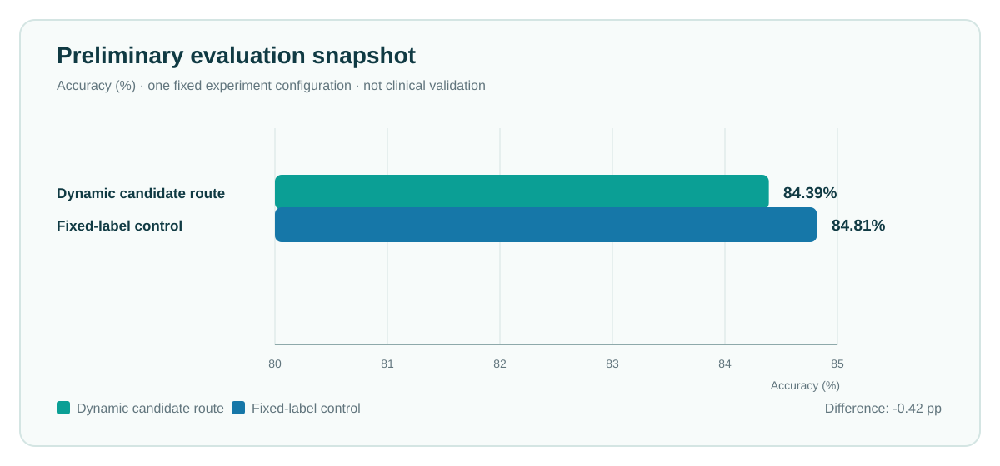
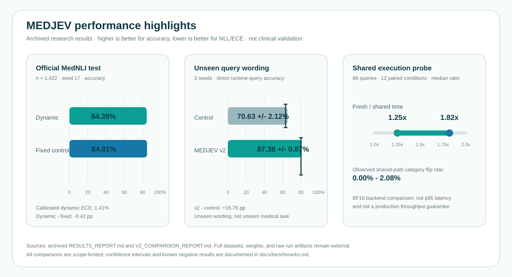

<p align="center">
  
</p>

<p align="center">
  <strong>Semantic evidence decisions for research-grade clinical AI.</strong><br>
  Runtime candidate queries · Explicit probabilities · Auditable interfaces
</p>

<p align="center">
  <a href="https://github.com/OWNER/MEDJEV/actions/workflows/ci.yml"></a>
  <a href="https://pypi.org/project/medjev/"></a>
  <a href="LICENSE"></a>
  
</p>

> **Research prototype.** MEDJEV is not a medical device, diagnostic system, or source of clinical advice. Do not use it with identifiable patient data or in patient care.

MEDJEV is an independent JEV-inspired research implementation. It treats a clinical record, a proposed statement, and an explicit candidate meaning set as a programmable evidence-relationship query. The default semantic space is `supported / contradicted / unresolved`; custom candidate sets are accepted but remain unvalidated unless matching calibration metadata exists.



## Why this repository exists

Medical language systems often collapse several different questions into one generated answer. MEDJEV separates the responsibilities:

1. Encode the supplied evidence.
2. Encode the candidate meanings at runtime.
3. Score the relationship between evidence and each candidate.
4. Normalize scores into a probability distribution over that candidate set.
5. Report calibration scope and safety-review signals explicitly.

The result is an interface for research on evidence grounding, not a claim that the model knows a patient's diagnosis or risk.

## What is included

| Area | Package | Purpose |
| --- | --- | --- |
| Text evidence | `medjev` | Dynamic candidate scoring, shared evidence heads, native-logit baselines, calibration, adapters, and CLI tools |
| Sleep extension | `sleepjev` | Experimental multi-resolution signal representations, temporal queries, event indexing, and baselines |
| Contracts | `tests/` | CPU-safe tests for permutation behavior, masking, query isolation, data leakage guards, and sleep workloads |
| Documentation | `docs/` | Architecture, installation, data policy, evaluation protocol, and release checklist |
| Examples | `examples/` | Small model-free API and schema examples that run without private data or checkpoints |

## Quick start

### 1. Install

Python 3.10 or newer is required. Install a PyTorch build compatible with your machine first if you need a specific CPU/CUDA/ROCm configuration.

```bash
python -m venv .venv
source .venv/bin/activate

# Windows PowerShell:
# .venv\\Scripts\\Activate.ps1

python -m pip install --upgrade pip
python -m pip install -e ".[test]"
```

For development, training, and sleep-signal experiments:

```bash
python -m pip install -e ".[all]"
```

### 2. Run the tests

```bash
pytest -q
```

### 3. Run the model-free contract example

```bash
python examples/validate_query_contract.py
```

### 4. Use a compatible dynamic checkpoint

Weights and datasets are deliberately excluded from Git. After obtaining a compatible checkpoint under its own license and access terms:

```python
from medjev import DecisionEngine, Query

engine = DecisionEngine("/path/to/dynamic-checkpoint")
answers = engine.evaluate(
    "The patient presents with cough and denies chest pain.",
    [
        Query("chest_pain", "The patient has chest pain."),
        Query("cough", "The patient has cough."),
    ],
)

for answer in answers:
    print(answer["prediction"])
    print(answer["probabilities"])
    print(answer["scope"])
```

The output is a relationship to the supplied evidence, not a disease probability.

## Package design

```text
src/
├── medjev/
│   ├── api.py          Stable runtime query contract
│   ├── data.py         JSONL loading and split audits
│   ├── schemas.py      Candidate schemas and calibration keys
│   ├── metrics.py      Probability, calibration, and evaluation metrics
│   ├── model.py        Shared evidence decision heads
│   ├── direct_jev.py   Direct dynamic candidate scorer
│   ├── gpu.py          Transformer-backed training/inference
│   ├── native.py       Native-logit and prefix-cache baselines
│   ├── experiment.py   Training/evaluation orchestration
│   ├── safety.py       Prototype deterministic review guards
│   └── adapters/       MedQA, PubMedQA, and SciFact record adapters
└── sleepjev/
    ├── model.py        Multi-resolution signal model
    ├── index.py        Temporal and event query indexing
    ├── events.py       Event annotation adapters
    ├── data.py         Dataset-independent signal contracts
    └── train.py        Experimental training/evaluation helpers
```

The source layout follows the standard `src/` packaging pattern. Public interfaces are intentionally small; training paths and dataset adapters are separate from runtime query objects.

## Evaluation snapshot

The chart below is a **preliminary single-seed research snapshot**, retained only to show how results are documented. It is not a clinical validation claim and does not establish superiority.



More importantly, the repository keeps the evaluation contract explicit: fixed development/calibration splits, held-out test data, candidate-order checks, calibration metadata, and negative results. See [the evaluation protocol](docs/benchmarks.md).

## Performance highlights

The following summary collects the strongest currently archived results without presenting them as a leaderboard. The official MedNLI result is a single-seed test evaluation; the unseen-query and shared-execution numbers come from a later three-seed development comparison whose test set had already been used in an earlier iteration. Higher is better for accuracy; lower is better for NLL and ECE.



| Capability | Best observed result | Scope and interpretation |
| --- | ---: | --- |
| Official MedNLI accuracy | **84.81%** fixed control; **84.39%** dynamic route | 1,422 official test records, Qwen3-0.6B, seed 17; dynamic route is not superior in this run |
| Calibrated dynamic ECE | **1.41%** | Same MedNLI test; temperature fitted on an independent development calibration split |
| Unseen runtime-query wording | **87.38% +/- 0.87%** | MEDJEV v2 curriculum, three seeds; direct answers over unseen wording, not a new medical task |
| Unseen-query NLL / log(K) | **0.4236 +/- 0.0439** | Same three-seed v2 comparison; lower is better and values are uncalibrated |
| Shared execution timing ratio | **1.25x-1.82x** | Median fresh/shared time over 96 queries and 12 conditions; shared BF16 execution showed 0.00%-2.08% category flips |
| Candidate-order probe | **0.00% flips; max probability delta 0** | 96-query robustness probe; an interface invariant check, not generalization evidence |

The strongest single query-family result was `refute` at **92.92% +/- 0.33%** in the v2 direct-query comparison. It is shown as a diagnostic slice rather than the project headline because query-family difficulty differs. Full definitions, baselines, confidence intervals, and negative results are in [docs/benchmarks.md](docs/benchmarks.md).

## Documentation map

- [Architecture](docs/architecture.md): components, invariants, data flow, and extension points.
- [Installation](docs/installation.md): CPU, CUDA, sleep extras, and checkpoint boundaries.
- [Development](docs/development.md): tests, lint, packaging, and pull-request workflow.
- [Data and models](docs/data-and-models.md): external data, licensing, de-identification, and manifests.
- [Benchmarks](docs/benchmarks.md): what can and cannot be claimed from current experiments.
- [Release checklist](docs/release.md): requirements before publishing a package or result.
- [中文交接说明](docs/OPEN_SOURCE_HANDOFF_ZH.md): repository scope and next actions.

## Design principles

- **Explicit semantics:** every candidate has an identifier and a meaning.
- **Set-aware scoring:** changing candidate wording or cardinality changes the query and requires validation.
- **No silent calibration:** unvalidated schemas are labeled uncalibrated.
- **Testable invariants:** candidate permutation, masking, query isolation, and split isolation are covered by tests.
- **Evidence before claims:** benchmark scores, safety guards, and clinical validity are separate concepts.
- **Restricted data stays external:** no patient records, credentials, raw datasets, or model checkpoints belong in Git.

## References for engineering practice

This repository uses general open-source engineering patterns inspired by [Pydantic](https://github.com/pydantic/pydantic), [FastAPI](https://github.com/fastapi/fastapi), [pytest](https://github.com/pytest-dev/pytest), [scikit-learn](https://github.com/scikit-learn/scikit-learn), [Requests](https://github.com/psf/requests), and [Ruff](https://github.com/astral-sh/ruff). No code from those projects is vendored here.

JEV-related scientific inspirations and source versions are recorded separately in `SOURCE_REGISTRY.json` when a research archive is added; they are not implied to be official implementations.

## License and citation

Software is released under the MIT License. Dataset, model, and third-party source terms remain separate. See [LICENSE](LICENSE), [CITATION.cff](CITATION.cff), and [data-and-models.md](docs/data-and-models.md).

## Status

Alpha research software. The stable surface is the query/schema contract and CPU-testable model logic. Training, external benchmark adapters, sleep data loaders, and generated result artifacts may change without backward compatibility.
