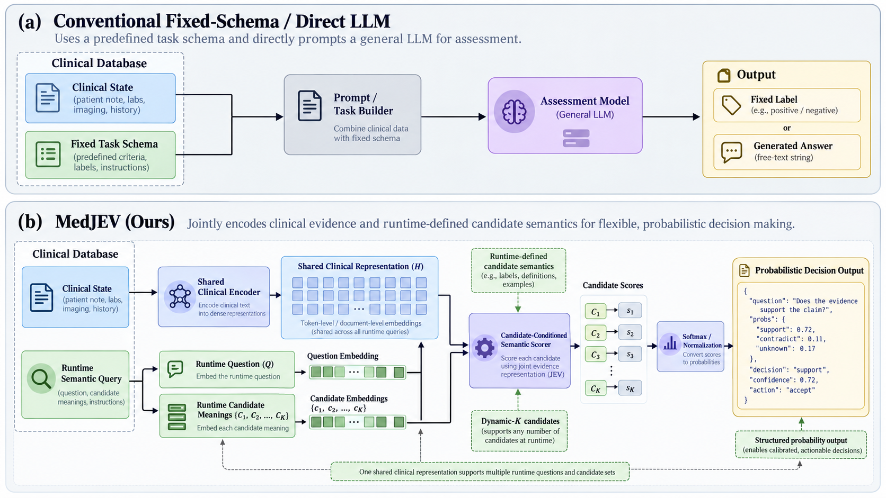
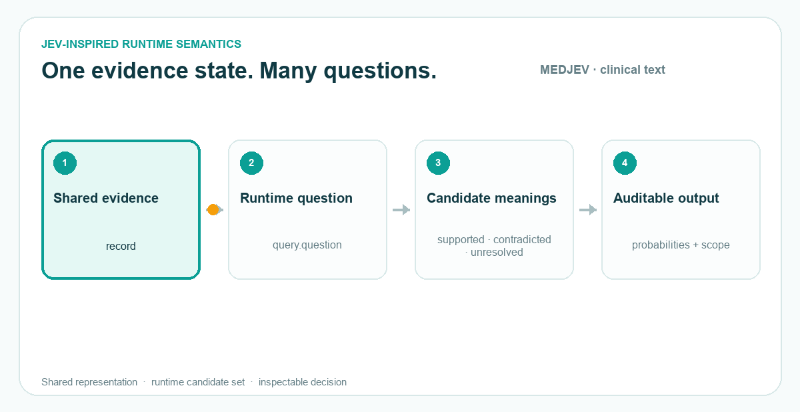
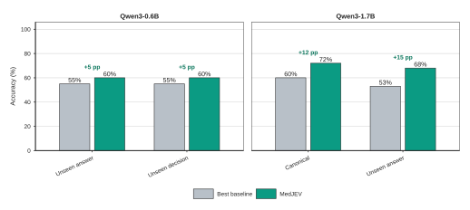

<p align="center">
  
</p>

<h2 align="center">Evidence-grounded decisions with runtime-defined semantics</h2>

<p align="center">
  <em>Clinical text · Biomedical literature · Sleep signals · Auditable benchmarks</em>
</p>

<p align="center">
  <a href="https://github.com/PAI-CUHK/MEDJEV/actions/workflows/ci.yml"></a>
  <a href="https://github.com/PAI-CUHK/MEDJEV/releases"></a>
  <a href="LICENSE"></a>
  
  
</p>

<h3>Research implementation for JEV-inspired evidence reasoning</h3>

<p>
  <strong>MEDJEV</strong> is an independent JEV-inspired, System One-style research implementation for typed decisions over clinical evidence and biomedical text. It treats a clinical record, a proposed statement, and an explicit candidate meaning set as a programmable evidence-relationship query. The default semantic space is <code>supported / contradicted / unresolved</code>; custom candidate sets are accepted but remain unvalidated unless matching calibration metadata exists.
</p>

<p><em>Research prototype: MEDJEV is not a medical device, diagnostic system, or source of clinical advice. Do not use it with identifiable patient data or in patient care.</em></p>

> **Project identity.** MEDJEV is not the official TypeSafe AI Jev API, SDK, hosted service, or a reproduction of proprietary Jev weights. It is an independent JEV-inspired research implementation for typed evidence decisions in biomedical settings.





### Interactive architecture demo

See the JEV-native decision pattern in motion: [**open the interactive MEDJEV / SLEEPJEV demo**](docs/demo/jev-demo.html). It is a self-contained, dependency-free animation showing one shared state, parallel `Choice` / `Score` / `Noul` questions, and typed answers with explicit probabilities instead of generated prose.

**Project site:** [**pai-cuhk.github.io/MEDJEV**](https://pai-cuhk.github.io/MEDJEV/) — a polished interactive overview of the MEDJEV architecture, JEV-inspired decision pattern, and SLEEPJEV relationship.

For the terminology and scope of this independent implementation, see [JEV and System One terminology](docs/jev.md). MEDJEV is not the official TypeSafe AI Jev model or SDK; the shared terms describe the research design pattern that this repository studies in biomedical settings.

### Directory-ready description

> Independent JEV-inspired typed decision research for clinical evidence and biomedical text, with runtime `Choice` / `Score` / `Noul`-style questions, explicit candidate probabilities, calibration metadata, and an experimental SLEEPJEV signal extension.

## Why this repository exists

Medical language systems often collapse several different questions into one generated answer. MEDJEV separates the responsibilities:

1. Encode the supplied evidence.
2. Encode the candidate meanings at runtime.
3. Score the relationship between evidence and each candidate.
4. Normalize scores into a probability distribution over that candidate set.
5. Report calibration scope and safety-review signals explicitly.

The result is an interface for research on evidence grounding, not a claim that the model knows a patient's diagnosis or risk.

## MEDJEV at a glance

MEDJEV is a research interface for turning evidence–statement relationships into explicit, inspectable decisions. It is designed for cases where the candidate meanings should be supplied at runtime instead of being hidden inside a fixed classifier head.

The central JEV-inspired idea is simple:

```text
clinical evidence + runtime question + candidate meanings
                         │
                         ▼
              shared evidence representation
                         │
                         ▼
             candidate-conditioned scoring
                         │
                         ▼
                probabilities + audit scope
```

MEDJEV is an independent implementation of this design direction. It does not claim to be the official JEV software, reproduce a proprietary implementation, or provide clinical validation.

### What can be supplied at runtime

| Object | Meaning | Example |
| --- | --- | --- |
| Evidence | The record, article passage, or signal-derived context being examined | A clinical note or PubMedQA passage |
| Question | The relationship to be evaluated | “Does the evidence support the claim?” |
| Candidate meanings | The mutually exclusive interpretations to score | `supported`, `contradicted`, `unresolved` |
| Output contract | A stable, machine-readable decision | Prediction, per-candidate probabilities, calibration scope, and backend |

This separation makes it possible to test semantic changes directly: changing the candidate wording, number of options, or question is a new query contract rather than an invisible change to a label index.

## Research applications

MEDJEV is intended as reusable research infrastructure across several evidence-grounded tasks:

| | Application area | How MEDJEV is used |
| --- | --- | --- |
| 🧾 | Clinical text review | Check whether a proposed statement is supported, contradicted, or unresolved by supplied evidence. |
| 📚 | Biomedical literature | Evaluate claims against passages from PubMedQA, SciFact, or other licensed research datasets. |
| 🧪 | Benchmark methodology | Compare fixed-label, direct-query, and dynamic-candidate routes under the same query and permutation contracts. |
| 📊 | Calibration research | Preserve probabilities together with schema and calibration metadata so confidence is not separated from scope. |
| 🛌 | Sleep and physiological signals | Use the experimental `sleepjev` package for temporal windows, event indexes, and signal-native candidate queries. |
| 🔍 | Robustness and auditing | Test candidate-order invariance, query isolation, masking behavior, split isolation, and unsupported-claim review guards. |

These are research use cases, not authorization for patient care, automated diagnosis, treatment recommendation, or deployment without an independent clinical, regulatory, privacy, and safety review.

## Related project

[**SLEEPJEV**](https://github.com/PAI-CUHK/SLEEPJEV) is the signal-native companion project for long-horizon polysomnography (PSG) research. It applies the same JEV-inspired separation of shared evidence formation, runtime questions, and candidate-conditioned decisions to sleep and physiological signals.

| Project | Primary evidence | Main research focus |
| --- | --- | --- |
| **MEDJEV** | Clinical text and biomedical literature | Runtime semantic decisions, evidence grounding, calibration, and auditable query contracts |
| **[SLEEPJEV](https://github.com/PAI-CUHK/SLEEPJEV)** | Overnight PSG and physiological signals | Reusable overnight representations, sparse temporal retrieval, and high-query serving |

The repositories are related but independently maintained. MEDJEV provides the general evidence–statement interface; SLEEPJEV specializes that design for reusable, long-duration sleep-signal representations. Neither project is a medical device or a clinical decision system.

## Why runtime candidate semantics matter

Traditional classification exposes a fixed label set chosen when the model is trained. That is convenient, but it can hide three different failure modes:

1. A model may be correct for the wrong candidate position.
2. A new wording may be treated as an unrelated label instead of a new semantic query.
3. A probability may be reported without explaining which schema, calibration split, or execution path produced it.

MEDJEV makes these choices explicit. Candidate meanings are encoded and scored against a shared evidence representation; probabilities are normalized over the supplied candidate set; and the result carries scope metadata. The test suite treats permutation behavior, masking, query isolation, and split isolation as contracts rather than informal expectations.

## Safety and interpretation boundaries

MEDJEV reports a relationship to supplied evidence. Unless a separate task definition and validation protocol establish otherwise, its output is not a disease probability, diagnosis, prognosis, treatment response, prevalence estimate, or patient risk score.

The repository deliberately keeps the following boundaries visible:

- **Evidence grounding is not factuality proof.** A high score means that the model selected a candidate under the supplied schema; it does not prove that the evidence is true or complete.
- **Calibration is schema-specific.** A temperature or calibration record must not be silently transferred to a new candidate set.
- **Permutation invariance is an interface property.** It tests whether meaning follows the candidate rather than its position; it is not evidence of clinical generalization.
- **Development accuracy is not clinical validation.** Public benchmark highlights are small-sample research snapshots and should not be read as deployment evidence.
- **Restricted material stays external.** Patient text, raw datasets, credentials, checkpoints, and private experiment archives are excluded from this repository.

## What is included

| Area | Package | Purpose |
| --- | --- | --- |
| Text evidence | `medjev` | Dynamic candidate scoring, shared evidence heads, native-logit baselines, calibration, adapters, and CLI tools |
| Sleep extension | `sleepjev` | Experimental multi-resolution signal representations, temporal queries, event indexing, and baselines |
| Contracts | `tests/` | CPU-safe tests for permutation behavior, masking, query isolation, data leakage guards, and sleep workloads |
| Documentation | `docs/` | Architecture, installation, development, and data policy |
| Examples | `examples/` | Small model-free API and schema examples that run without private data or checkpoints |

## Quick start

### 1. Install

Python 3.10 or newer is required. Install a PyTorch build compatible with your machine first if you need a specific CPU/CUDA/ROCm configuration.

```bash
python -m venv .venv
source .venv/bin/activate

# Windows PowerShell:
# .venv\\Scripts\\Activate.ps1

python -m pip install --upgrade pip
python -m pip install -e ".[test]"
```

For development, training, and sleep-signal experiments:

```bash
python -m pip install -e ".[all]"
```

### 2. Run the tests

```bash
pytest -q
```

### 3. Run the model-free contract example

```bash
python examples/validate_query_contract.py
```

### 4. Use a compatible dynamic checkpoint

Weights and datasets are deliberately excluded from Git. After obtaining a compatible checkpoint under its own license and access terms:

```python
from medjev import DecisionEngine, Query

engine = DecisionEngine("/path/to/dynamic-checkpoint")
answers = engine.evaluate(
    "The patient presents with cough and denies chest pain.",
    [
        Query("chest_pain", "The patient has chest pain."),
        Query("cough", "The patient has cough."),
    ],
)

for answer in answers:
    print(answer["prediction"])
    print(answer["probabilities"])
    print(answer["scope"])
```

The output is a relationship to the supplied evidence, not a disease probability.

## Package design

```text
src/
├── medjev/
│   ├── api.py          Stable runtime query contract
│   ├── data.py         JSONL loading and split audits
│   ├── schemas.py      Candidate schemas and calibration keys
│   ├── metrics.py      Probability, calibration, and evaluation metrics
│   ├── model.py        Shared evidence decision heads
│   ├── direct_jev.py   Direct dynamic candidate scorer
│   ├── gpu.py          Transformer-backed training/inference
│   ├── native.py       Native-logit and prefix-cache baselines
│   ├── experiment.py   Training/evaluation orchestration
│   ├── safety.py       Prototype deterministic review guards
│   └── adapters/       MedQA, PubMedQA, and SciFact record adapters
└── sleepjev/
    ├── model.py        Multi-resolution signal model
    ├── index.py        Temporal and event query indexing
    ├── events.py       Event annotation adapters
    ├── data.py         Dataset-independent signal contracts
    └── train.py        Experimental training/evaluation helpers
```

The source layout follows the standard `src/` packaging pattern. Public interfaces are intentionally small; training paths and dataset adapters are separate from runtime query objects.

## Benchmark highlights

The following table reports only development slices with a **≥5 percentage-point** MedJEV lead over the strongest observed baseline for the same backbone and condition. Results are identity-restored accuracy on a fixed 50-example PubMedQA development partition, averaged across four candidate permutations. The held-out 500-example test split was not accessed.

| Backbone | Evaluation slice | Baseline method | Baseline | MedJEV | Difference | Permutation behavior |
| --- | --- | --- | ---: | ---: | ---: | --- |
| Qwen3-0.6B | Unseen answer | Direct | 55% | **60%** | **+5 pp** | invariant |
| Qwen3-0.6B | Unseen decision | Direct | 55% | **60%** | **+5 pp** | invariant |
| Qwen3-1.7B | Canonical | Direct | 60% | **72%** | **+12 pp** | invariant |
| Qwen3-1.7B | Unseen answer | Direct | 53% | **68%** | **+15 pp** | invariant |



These are selective development results, not an overall ranking, statistical-significance claim, or clinical validation. The figure is generated in R from the public summary values in [figures/scripts/pubmedqa_dev_performance.R](figures/scripts/pubmedqa_dev_performance.R).

## Documentation

- [Project site](https://pai-cuhk.github.io/MEDJEV/): interactive overview and demo.
- [Architecture](docs/architecture.md): components, invariants, data flow, and extension points.
- [JEV terminology](docs/jev.md): typed decisions, `Choice` / `Score` / `Noul`, and scope boundaries.
- [Installation](docs/installation.md): CPU, CUDA, sleep extras, and checkpoint boundaries.
- [Development](docs/development.md): tests, lint, packaging, and pull-request workflow.
- [Data and models](docs/data-and-models.md): external data, licensing, de-identification, and manifests.
- [Contributing](CONTRIBUTING.md): development and pull-request expectations.
- [Security](SECURITY.md): sensitive-data and vulnerability-reporting policy.

## Design principles

- **Explicit semantics:** every candidate has an identifier and a meaning.
- **Set-aware scoring:** changing candidate wording or cardinality changes the query and requires validation.
- **No silent calibration:** unvalidated schemas are labeled uncalibrated.
- **Testable invariants:** candidate permutation, masking, query isolation, and split isolation are covered by tests.
- **Evidence before claims:** benchmark scores, safety guards, and clinical validity are separate concepts.
- **Restricted data stays external:** no patient records, credentials, raw datasets, or model checkpoints belong in Git.

## References for engineering practice

This repository uses general open-source engineering patterns inspired by [Pydantic](https://github.com/pydantic/pydantic), [FastAPI](https://github.com/fastapi/fastapi), [pytest](https://github.com/pytest-dev/pytest), [scikit-learn](https://github.com/scikit-learn/scikit-learn), [Requests](https://github.com/psf/requests), and [Ruff](https://github.com/astral-sh/ruff). No code from those projects is vendored here.

JEV-related scientific inspirations are described as research context only; MEDJEV is an independent implementation and is not an official JEV release.

## License and citation

Software is released under the MIT License. Dataset, model, and third-party source terms remain separate. See [LICENSE](LICENSE), [CITATION.cff](CITATION.cff), and [data-and-models.md](docs/data-and-models.md).

If this repository is useful in research, please cite the version used. GitHub can generate citation formats from [CITATION.cff](CITATION.cff); archived releases should be preferred when a DOI is available.

## Status

Alpha research software. The stable surface is the query/schema contract and CPU-testable model logic. Training, external benchmark adapters, sleep data loaders, and generated result artifacts may change without backward compatibility.
